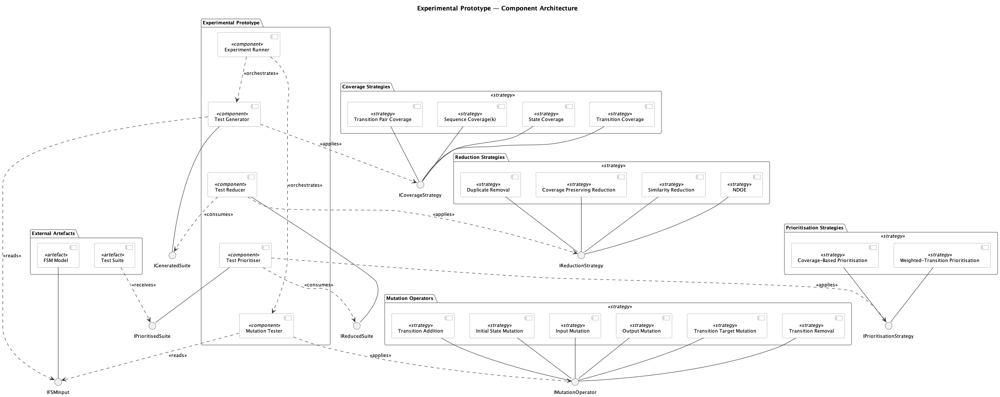
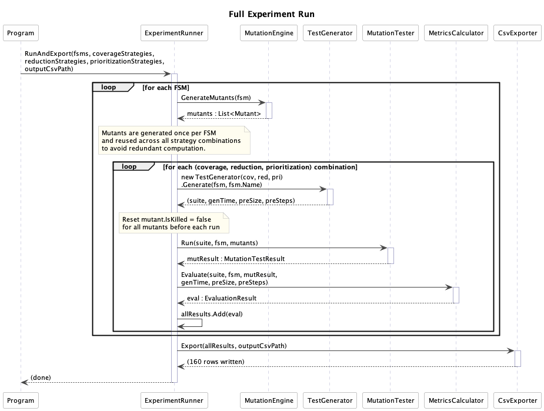
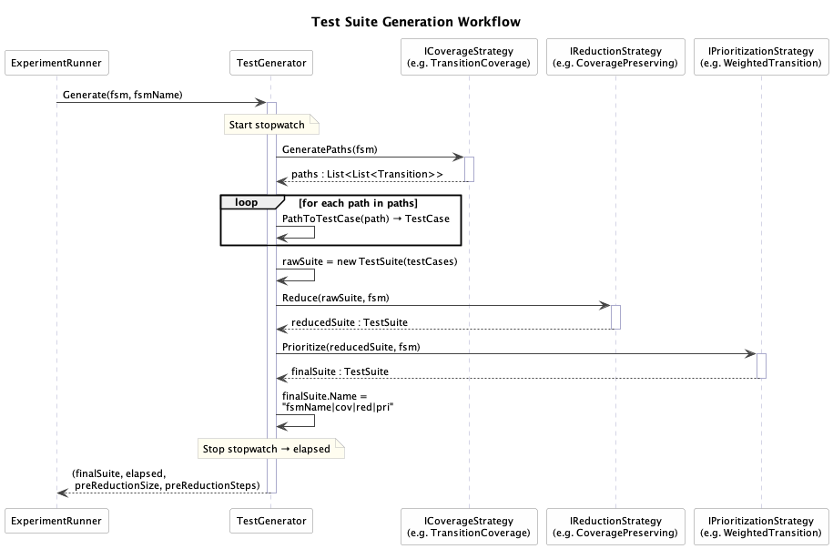
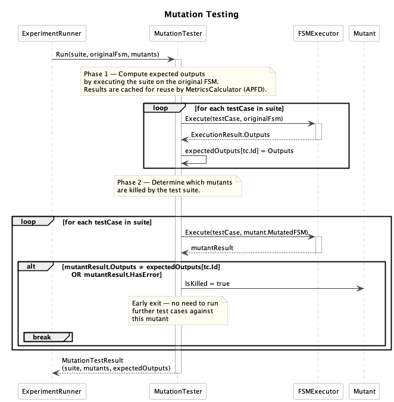

# Experimental Prototype

**Experimental Prototype** — Gonçalo Miranda, ISEP  
*Software Testing with Finite State Machines*

---

## Overview

This repository contains the experimental prototype developed for the dissertation *Software Testing with Finite State Machines*. The prototype was built as a configurable research artefact to support the systematic evaluation of FSM-based automated test generation strategies under controlled conditions.

Within the dissertation, this application acts as the experimental bridge between the conceptual design of the approach and its empirical assessment. It allows different combinations of coverage, reduction, and prioritisation strategies to be applied to the same deterministic finite state machine models so their effects can be measured and compared consistently.

The prototype addresses practical challenges identified in the thesis, namely test suite redundancy, computational cost, and the difficulty of producing test suites that remain effective while being manageable for automated software testing workflows. Its role is not to serve as a production-ready framework, but to provide an operational environment for generating evidence about trade-offs involving fault detection capability, structural coverage, suite compactness, execution ordering, and generation cost.

The current implementation is written in C# on .NET 8 and evaluates strategy combinations over five benchmark FSM models:

- `tcp_fsm.json`
- `tls_client_fsm.json`
- `mqtt_fsm.json`
- `synthetic_50_fsm.json`
- `synthetic_100_fsm.json`

### Architecture

The component diagram below shows the structure of the prototype, its main components, the strategy plug-in groups, and the interfaces that connect them.



#### Key Workflows

**Experiment Run** — top-level orchestration: for each FSM the `ExperimentRunner` generates mutants once, then iterates over every strategy combination, generating and evaluating a test suite for each.



**Test Generation** — internal flow of a single `TestGenerator.Generate()` call: applies the selected coverage strategy to the FSM, then passes the resulting suite through the reduction and prioritisation stages.



**Mutation Testing** — how `MutationTester` runs a test suite against a set of mutants and accumulates kill counts and per-operator scores.



---

## Prerequisites

- [.NET 8 SDK](https://dotnet.microsoft.com/download/dotnet/8.0) or later

Verify installation:

```bash
dotnet --version
```

---

## Running the Framework

### 1. Run with the bundled benchmark FSMs

```bash
dotnet run
```

This executes the experimental run across the bundled benchmark models using the configured combinations of coverage, reduction, and prioritisation strategies.

### 2. Run with custom FSM models

```bash
dotnet run -- path/to/your_fsm.json
```

Multiple files are supported:

```bash
dotnet run -- fsm1.json fsm2.json fsm3.json
```

---

## Output

Results are written to:

```text
Results/experiment_results.csv
```

### CSV Columns

| Column | Description |
|--------|-------------|
| FSM | Name of the FSM model |
| CoverageStrategy | Coverage criterion used |
| ReductionStrategy | Reduction method applied |
| PrioritizationStrategy | Ordering technique applied |
| SuiteSize | Number of test cases in the suite after reduction |
| TotalSteps | Total number of steps across all test cases after reduction |
| PreReductionSuiteSize | Number of test cases before reduction |
| PreReductionTotalSteps | Total number of steps before reduction |
| ReductionRatio | Fraction of test cases removed by the reduction stage |
| ExecutionTimeSavings | Fraction of test execution workload removed by reduction |
| StateCoverage | Fraction of reachable states covered |
| TransitionCoverage | Fraction of FSM transitions covered |
| MutationScore | Fraction of generated mutants killed |
| KilledMutants | Absolute number of killed mutants |
| TotalMutants | Total mutants generated |
| APFD | Average Percentage of Faults Detected |
| GenerationTimeMs | Wall-clock generation time in milliseconds |
| MS_TransitionTargetMutation | Mutation score for `TransitionTargetMutation` |
| MS_OutputMutation | Mutation score for `OutputMutation` |
| MS_TransitionRemoval | Mutation score for `TransitionRemoval` |
| MS_TransitionAddition | Mutation score for `TransitionAddition` |
| MS_InputMutation | Mutation score for `InputMutation` |
| MS_InitialStateMutation | Mutation score for `InitialStateMutation` |

Empty cells in per-operator mutation score columns indicate that a given operator produced no mutants for that FSM.

---

## FSM JSON Format

```json
{
  "name": "MyFSM",
  "initialState": "S0",
  "states": ["S0", "S1", "S2"],
  "transitions": [
    { "from": "S0", "to": "S1", "input": "login", "output": "ok" },
    { "from": "S1", "to": "S2", "input": "confirm", "output": "success" },
    { "from": "S2", "to": "S0", "input": "logout", "output": "bye" }
  ]
}
```

- `name` - optional label
- `initialState` - must match a state in the `states` array
- `states` - list of all state names
- `transitions` - each transition must define `from`, `to`, `input`, and `output`

---

## Strategies Implemented

### Coverage Strategies

| Name | Criterion |
|------|-----------|
| `StateCoverageStrategy` | All reachable states visited |
| `TransitionCoverageStrategy` | All reachable transitions fired |
| `TransitionPairCoverageStrategy` | All consecutive transition pairs covered |
| `SequenceCoverageStrategy(maxLen)` | Consecutive sequences up to a maximum length |

### Reduction Strategies

| Name | Approach |
|------|----------|
| `DuplicateRemovalStrategy` | Exact duplicate test-case removal |
| `MutationScorePreservingReductionStrategy` | Greedy selection guided by mutant kills, length, and resets — guaranteed zero mutation score loss |
| `CoveragePreservingReductionStrategy` | Greedy set-cover preserving transition coverage achieved by the original suite |
| `SimilarityReductionStrategy(threshold)` | Coverage-preserving reduction followed by similarity filtering |

### Prioritization Strategies

| Name | Ordering |
|------|---------|
| `CoverageBasedPrioritization` | Greedy ordering by additional transition coverage |
| `WeightedTransitionPrioritization` | Greedy ordering favouring rarer transitions earlier |

### Mutation Operators

| Operator | Fault Modelled |
|----------|---------------|
| `TransitionTargetMutation` | Incorrect next state |
| `OutputMutation` | Incorrect output label |
| `TransitionRemoval` | Missing transition |
| `TransitionAddition` | Spurious extra transition |
| `InputMutation` | Incorrect triggering input |
| `InitialStateMutation` | Incorrect starting state |

---

## Metrics

| Metric | Description |
|--------|-------------|
| Suite Size | Number of test cases after reduction |
| Total Steps | Total number of transition firings across the suite |
| Reduction Ratio | Fraction of test cases removed relative to the pre-reduction suite |
| Execution-Time Savings | Fraction of transition firings removed relative to the pre-reduction suite |
| State Coverage | Fraction of reachable states visited by the suite |
| Transition Coverage | Fraction of transitions exercised by the suite |
| Mutation Score | Fraction of generated mutants killed by the suite |
| Per-Operator Mutation Score | Mutation score computed separately for each mutation operator |
| APFD | How early faults are detected in the prioritised execution order |
| Generation Time | Time required to generate, reduce, and prioritise the final suite |
