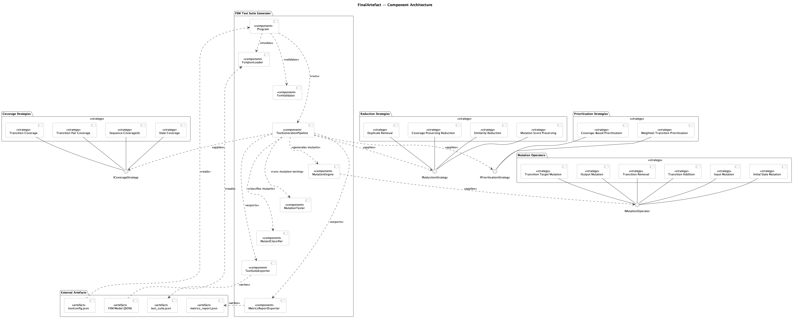
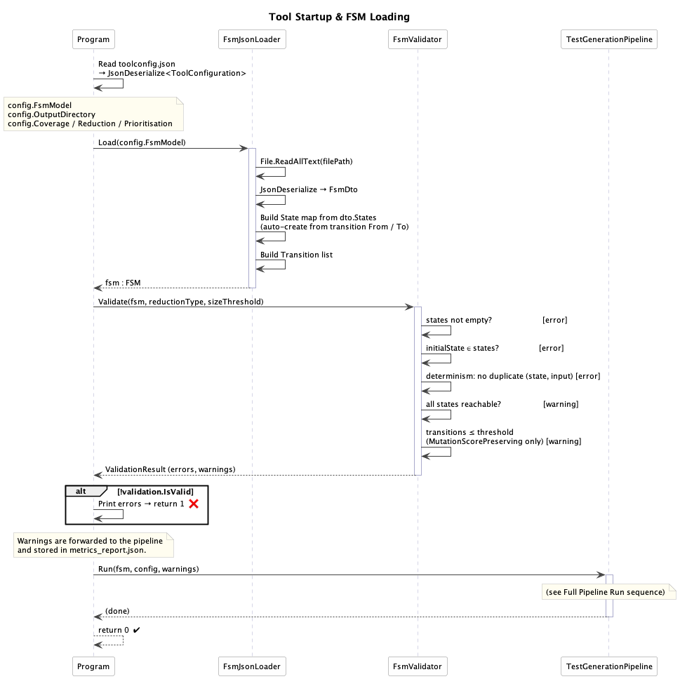
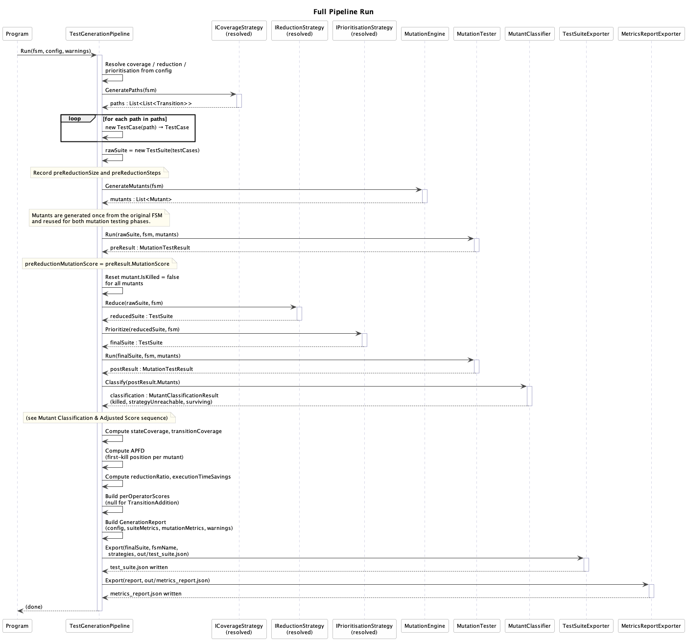
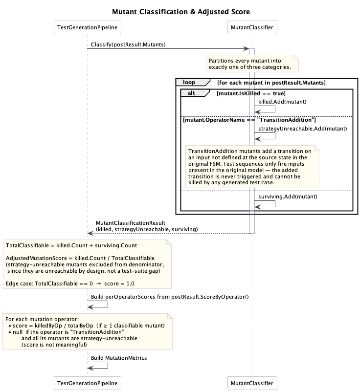

# Final Artefact

**Final Artefact** — Gonçalo Miranda, ISEP  
*Software Testing with Finite State Machines*

---

## Overview

This repository contains the final software artefact developed for the dissertation *Software Testing with Finite State Machines*. It implements a configurable FSM-based test-suite generation tool that takes a deterministic finite state machine model as input, generates test cases according to a selected coverage criterion, applies suite reduction and prioritisation strategies, and evaluates the resulting suite through mutation testing.

Within the dissertation, this application represents the operational consolidation of the proposed approach. While the experimental prototype was used to compare strategy combinations across benchmark FSMs, this artefact focuses on the end-to-end execution of a single configured pipeline over a target FSM model and produces reusable output artefacts for further analysis or integration with external testing workflows.

The tool addresses the main concerns discussed in the thesis: generating structurally strong test suites from FSM models, reducing redundancy without harming fault-detection capability, ordering tests to detect faults earlier, and reporting the trade-offs between suite size, execution effort, coverage, and mutation score. It is implemented in C# on .NET 8 and exports both the generated test suite and a detailed metrics report in JSON format.

### Architecture

The component diagram below shows the structure of the final artefact, its main components, the configurable strategy groups, and the external artefacts used during execution.



#### Key Workflows

**Tool Startup and FSM Loading** — the top-level startup flow: `Program` loads `toolconfig.json`, reads the FSM model, validates it, and starts the pipeline.



**Full Pipeline Run** — the main generation flow inside `TestGenerationPipeline.Run()`: resolve configured strategies, generate the raw suite, run pre-reduction mutation testing, reduce, prioritise, run post-reduction mutation testing, compute metrics, and export the outputs.



**Mutant Classification and Adjusted Score** — how the artefact classifies killed, strategy-unreachable, and surviving mutants, and computes the adjusted mutation score used in the final report.



---

## Prerequisites

- [.NET 8 SDK](https://dotnet.microsoft.com/download/dotnet/8.0) or later

Verify installation:

```bash
dotnet --version
```

---

## Running the Framework

### 1. Run with the bundled configuration file

```bash
dotnet run
```

This uses `toolconfig.json` from the current directory.

Note: the bundled configuration currently points to:

```text
../ExperimentalPrototype/Examples/tcp_fsm.json
```

Update that path if you want to run the artefact independently with another FSM model.

### 2. Run with a custom configuration file

```bash
dotnet run -- path/to/config.json
```

Example configuration:

```json
{
  "fsmModel": "path/to/your_fsm.json",
  "outputDirectory": "out/",
  "coverage": {
    "type": "TransitionPairCoverage",
    "sequenceLength": 3
  },
  "reduction": {
    "type": "MutationScorePreserving",
    "fsmSizeThreshold": 50,
    "similarityThreshold": 0.8
  },
  "prioritisation": {
    "type": "CoverageBased"
  }
}
```

---

## Output

Results are written to the configured output directory:

```text
out/test_suite.json
out/metrics_report.json
```

### `test_suite.json`

Contains the prioritised final test suite ready for downstream use.

| Field | Description |
|--------|-------------|
| `metadata.fsmName` | Name of the FSM under test |
| `metadata.generatedAt` | UTC timestamp of generation |
| `metadata.coverageStrategy` | Coverage strategy used |
| `metadata.reductionStrategy` | Reduction strategy used |
| `metadata.prioritisationStrategy` | Prioritisation strategy used |
| `metadata.totalTestCases` | Number of generated test cases in the final suite |
| `testCases[].id` | Test-case identifier |
| `testCases[].priority` | Execution order after prioritisation |
| `testCases[].steps[]` | Ordered FSM transitions with expected outputs |

### `metrics_report.json`

Contains the configuration used, suite-level metrics, mutation-testing results, and validation warnings.

| Field | Description |
|--------|-------------|
| `fsmName` | Name of the FSM model |
| `generatedAt` | UTC timestamp of report generation |
| `configuration` | Strategies selected for coverage, reduction, and prioritisation |
| `suiteMetrics.suiteSize` | Number of test cases after reduction and prioritisation |
| `suiteMetrics.totalSteps` | Total number of steps in the final suite |
| `suiteMetrics.preReductionSuiteSize` | Number of test cases before reduction |
| `suiteMetrics.preReductionTotalSteps` | Total number of steps before reduction |
| `suiteMetrics.reductionRatio` | Fraction of test cases removed by reduction |
| `suiteMetrics.executionTimeSavings` | Fraction of steps removed relative to the raw suite |
| `suiteMetrics.stateCoverage` | Fraction of reachable states covered |
| `suiteMetrics.transitionCoverage` | Fraction of transitions covered |
| `suiteMetrics.apfd` | Average Percentage of Faults Detected |
| `suiteMetrics.generationTimeMs` | Total pipeline execution time in milliseconds |
| `mutationMetrics.preReductionMutationScore` | Mutation score before suite reduction |
| `mutationMetrics.postReductionMutationScore` | Mutation score after reduction and prioritisation |
| `mutationMetrics.adjustedMutationScore` | Mutation score excluding strategy-unreachable mutants |
| `mutationMetrics.totalMutants` | Total number of generated mutants |
| `mutationMetrics.killedMutants` | Number of killed mutants |
| `mutationMetrics.strategyUnreachableMutants` | Mutants unreachable by design |
| `mutationMetrics.survivingMutants` | Number of surviving mutants |
| `mutationMetrics.perOperatorScores` | Per-operator mutation score map |
| `warnings` | Validation warnings emitted during startup |

---

## FSM JSON Format

```json
{
  "name": "MyFSM",
  "initialState": "S0",
  "states": ["S0", "S1", "S2"],
  "transitions": [
    { "from": "S0", "to": "S1", "input": "login", "output": "ok" },
    { "from": "S1", "to": "S2", "input": "confirm", "output": "success" },
    { "from": "S2", "to": "S0", "input": "logout", "output": "bye" }
  ]
}
```

- `name` - optional label
- `initialState` - initial state of the FSM
- `states` - list of state names
- `transitions` - each transition must define `from`, `to`, `input`, and `output`

The loader is permissive in one specific way: if a state referenced by `initialState`, `from`, or `to` is missing from `states`, it is created during loading. The validator then checks structural correctness, determinism, and reachability.

---

## Strategies Implemented

### Coverage Strategies

| Name | Criterion |
|------|-----------|
| `StateCoverage` | All reachable states visited |
| `TransitionCoverage` | All reachable transitions fired |
| `TransitionPairCoverage` | All consecutive transition pairs covered |
| `SequenceCoverage` | Consecutive transition sequences up to a configured maximum length |

### Reduction Strategies

| Name | Approach |
|------|----------|
| `DuplicateRemoval` | Exact duplicate test-case removal |
| `CoveragePreserving` | Greedy transition-coverage-preserving reduction |
| `SimilarityReduction` | Coverage-preserving reduction followed by similarity filtering |
| `MutationScorePreserving` | Greedy mutant-kill-preserving reduction |

### Prioritisation Strategies

| Name | Ordering |
|------|---------|
| `CoverageBased` | Greedy ordering by additional transition coverage |
| `WeightedTransition` | Greedy ordering favouring rarer transitions earlier |

### Mutation Operators

| Operator | Fault Modelled |
|----------|---------------|
| `TransitionTargetMutation` | Incorrect next state |
| `OutputMutation` | Incorrect output label |
| `TransitionRemoval` | Missing transition |
| `TransitionAddition` | Spurious extra transition |
| `InputMutation` | Incorrect triggering input |
| `InitialStateMutation` | Incorrect starting state |

---

## Metrics

| Metric | Description |
|--------|-------------|
| Suite Size | Number of test cases in the final suite |
| Total Steps | Total number of transition firings across the final suite |
| Reduction Ratio | Fraction of test cases removed relative to the raw suite |
| Execution-Time Savings | Fraction of transition firings removed relative to the raw suite |
| State Coverage | Fraction of reachable states visited by the final suite |
| Transition Coverage | Fraction of transitions exercised by the final suite |
| Pre-Reduction Mutation Score | Mutation score of the raw generated suite |
| Post-Reduction Mutation Score | Mutation score of the reduced and prioritised suite |
| Adjusted Mutation Score | Mutation score excluding strategy-unreachable mutants |
| Per-Operator Mutation Score | Mutation score computed separately for each mutation operator |
| APFD | How early faults are detected in the prioritised execution order |
| Generation Time | Time required to run the full pipeline |
